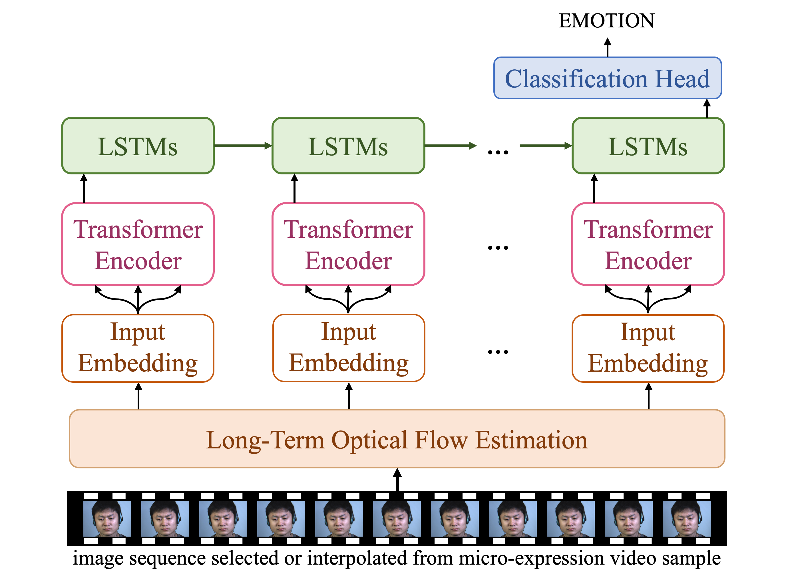
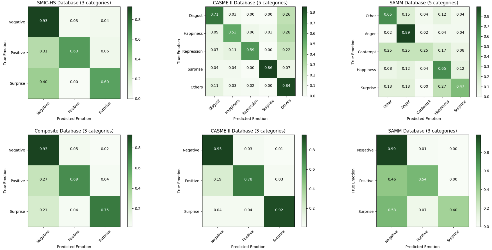

# README

### Short and Long Range Relation Based Spatio-Temporal Transformer for Micro-Expression Recognition

This is the offical code for SLSTT. See our paper on [[IEEE]](https://ieeexplore.ieee.org/document/9915457) and [[arXiv]](https://arxiv.org/abs/2112.05851)



The whole code is not available now, but you can use

```
python LOSO.py -e
```

to test the exisitng example models, which could be download from [huggingface](https://huggingface.co/zlf-ffff/SLSTT).

<!-- ### Requirements&Environments

* I train this model on single 3090
* you can import my environment by environments.yaml, which may add many unnecessary packages.You can also simply pip install when you find it is necessary. -->

### Before training


  You can see data directory <preprocess/databases>.


  Please put the raw data in <preprocess/databases/DATABASE/data>, for example:
  
  **<preprocess/databases/casme2/data>**.

  After putting the raw data in the correct directory, you can simplely run 
  ```
  python preprocess/data_init.py 
  ```	
  to generate all long-term optical flow input images from SMIC, CASME II and SAMM databases.

### Training


You can simply use:

```
python main.py -d DATABASE -s S
```
or 
```
python LOSO.py -d DATABASE
```

to run slstt for **DATABASE** ("smic", "casme2", "samm" or "com-DATABASE") and left subject S for validation, for further training(there is also alternative option) please carefully read the code.

### Evaluate


```
python main.py -d DATABASE -s S --modal-path XXX -e
```

Fill the XXX with your checkpoint path with leave subject S out.

Also you can evaluate with LOSO start from subjuect S, (for examle, samm should start from subject 6).

```
python LOSO.py -d DATABASE --start-sub S  --dir FOLDER -e
```

Please ensure all your models for **DATABASE** ("com" for composite dataset of CDE) are in **FOLDER**.


### Correction of Confusion Matrix


On IEEE version, we mis-swapped the predictions and targets when generate visualised confusion matrix images. Sorry for any confusion this may have caused. We have corrected our arXiv version and show the correct one here.



### Citiation


If you find our paper and this code useful in your research, please consider citing:

```
@article{zhang2022short,
  title={Short and long range relation based spatio-temporal transformer for micro-expression recognition},
  author={Zhang, Liangfei and Hong, Xiaopeng and Arandjelovi{\'c}, Ognjen and Zhao, Guoying},
  journal={IEEE Transactions on Affective Computing},
  year={2022},
  publisher={IEEE},
  pages={1-13},
  doi={10.1109/TAFFC.2022.3213509}
  }
```
